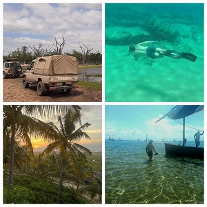

## *About Me*

Hello! I’m Hendrik Johann Schmidt, born on January 27, 2001. I’m a calm and caring individual with a unique blend of introversion and extroversion. I thrive in both quiet moments of reflection and social interactions.

I have a deep love for nature and outdoor activities. Hiking and rock climbing are not just hobbies but passions that allow me to connect with the world around me. Some of my proudest achievements include hiking Iran’s highest peaks: Mount Damavand, a dormant stratovolcano standing at 5,609 meters, and Alam-Kuh, the second highest summit in Iran at 4,848 meters.

In addition to my outdoor pursuits, I’ve achieved Grade 6 in piano, which reflects my appreciation for music. My taste ranges from 1970s to 1990s hits and modern Afrikaans and English songs. When it comes to food, I’m a fan of Indian cuisine and have a soft spot for ice cream as my go-to dessert.

  

My motto is: “Never be afraid of what people will think of you.” This philosophy drives me to approach challenges with confidence and resilience.

Academically, I’m well-equipped to excel in roles such as systems analyst and software programmer. My education has honed my attention to detail and my ability to adapt quickly. I am a hardworking and determined individual seeking to contribute to a dynamic company. With a strong motivation to achieve results and a commitment to continuous learning.

## *Computer Skills*

* MS Windows
* HTML
* Microsoft Office Suite –     
       PowerPoint, Excel, Word, Outlook, Access
* Ticketing System (Autotask)
* Microsoft 365 Apps admin centre
* G Suite
* GitHub
* Java
* C++
* C#
* Python

## *My Documentation*

* [Cover Letter and CV](CV.pdf)    
* [LinkedIn](https://www.linkedin.com/in/hendrik-schmidt-24a951285/?trk=opento_sprofile_details)

## *My Projects*

[The repository for this website](https://github.com/DarthvaderJouPa/DarthvaderJouPa.github.io)    
[Group project repository](https://github.com/JPJvv/ApexSystem323)

## *Contact Information*

* Email address: schmidthendrik1127@gmail.com
* Cellphone number: +27 (0) 82 896 1266
