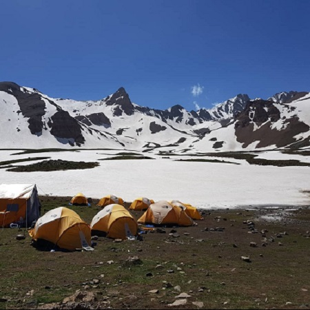

## *About Me*

I am Hendrik Johann Schmidt. I was born on the 27th of January, 2001. 

I am a very calm, caring person. I am 50% introvert and 50% extrovert according to a test.

I love nature and doing outdoor activities in my free time. My hobbies are to go hiking in the mountains and rock climbing.  

  

##### Personal achievements:

I hiked the two highest peaks in Iran namely:

* Mount Damavand which is a dormant stratovolcano and is the highest peak in Iran and Western Asia, the highest volcano in Asia, and the 3rd highest volcano in the Eastern Hemisphere at an elevation of 5 609 meters.

* Alam-Kuh is the second highest summit of Iran. Located at the heart of the Alborz mountain range, only 40km south from the Caspian sea. Alam Kuh is part of the Takht-e Suleyman subrange and is at an elevation of 4 848 meters.  

  

* I obtained my grade 6 in piano.

##### My favourites:

  * Food: Indian cuisine  
  * Desert:  Ice cream  
  * Music: Anything form the 1970 - 1990's and modern Afrikaans and English songs

##### My motto: 
Never be afraid of what people will think of you.

